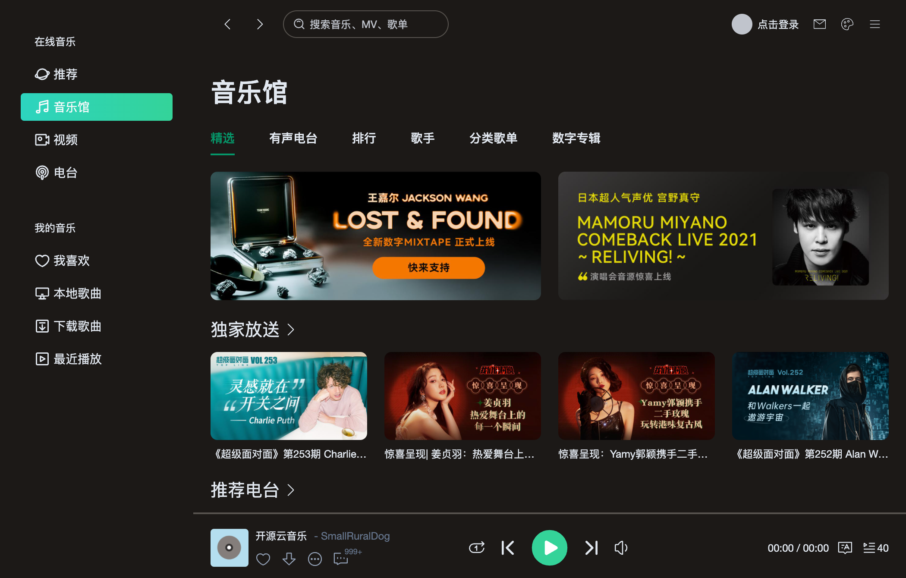

# VUE3-MUSIC

基于 VUE3+TS 开发的音乐播放器，界面模仿QQ音乐mac客户端。

在线体验：https://music8.online

将浏览器大小设置成1050*670，体验效果更好！界面是自适应的，使用[tailwindcss.com](https://www.tailwindcss.com)来实现

手机端未适配，后期会使用[Flutter](https://flutter.dev)单独开发手机客户端，使用[Electron](https://www.electronjs.org)打包桌面客户端并内置API服务。

## 一键部署

[](https://edgeone.ai/pages/new?from=github&template=https://github.com/shredder-boop/music-fe)

## 本地安装

```
git clone https://github.com/shredder-boop/music-fe
cd music-fe
npm i
npm run dev
```

## 网易云音乐API

需要运行API服务才能正常体验

[腾讯云 serverless 部署](https://binaryify.github.io/NeteaseCloudMusicApi/#/?id=%e8%85%be%e8%ae%af%e4%ba%91-serverless-%e9%83%a8%e7%bd%b2)

修改代码，替换为自己的网易云音乐API

```js
const pageData = reactive({
	host: 'https://xxx.ap-guangzhou.tencentscf.com',
  loading: false,
  error: false
})
```

## UI





## PS

通过此开源项目学习VUE3的强大..加油！

## 原参考项目

https://github.com/SmallRuralDog/vue3-music
